# 2022赛季视觉部第一次培训——基于轮廓的传统视觉

###### 机械是肉体， 电控是大脑， 视觉是灵魂
----------------------------------------

### OpenCV基本组件——Mat

``Mat``是``OpenCV``中常用的基本类型，即矩阵类。在``OpenCV``中常常被用于储存图像数据。

##### Mat的构造
常用的``Mat``构造有两种：
* 直接构造
	``Mat()``
	这种``Mat``由于未定义维度和大小，无法直接使用，一般用来接收函数的输出或接收读如的数据，如图片。
* 构造一个制定行数列数的矩阵
	``Mat(int rows, int cols, int type)``
	创建一个行数为``rows``，列数为``cols``，数据类型为``type``的矩阵。
	值得说明的是，``type``的类型有很多，你可以在[OpenCV官网](https://docs.opencv.org/master/)上在找到更多的信息，这里只介绍其中部分。
	* CV_8UC3
		这是很常用的处理图片的格式，其中``8U``代表``8``位无符号整数，``C3``代表``3``通道，这是一般用来储存3通道图像的格式。
	* CV_64FC1
		这种格式可以储存一般的实数阵，其中``64F``代表``64``位浮点数，``C1``代表单通道。

##### 矩阵的随机访问
``Mat``类型本身没有实现``[]``的随机访问，因此如果想要随机访问矩阵中的元素，需要其他方法。
* ``Mat``类提供了``at``方法，其声明如下：
	```cpp
	template<typename _Tp >
	_Tp& cv::Mat::at(int row, int col)
	```
	通过``at``方法，可以随机访问``row``行``col``列的元素，下面是一个简单的例子：
	```cpp
	#include <opencv2/core/core.hpp>
	#include <iostream>
	int main()
	{
		cv::Mat src = cv::Mat::eye(3, 3, CV_8UC1);
		src.at<uint8_t>(1, 2) = static_cast<uint8_t>(2);
		std::cout << src << std::endl;
		return 0;
	}
	```
* ``Mat``类提供的``ptr``方法也可以借助指针的方式实现随机访问。
	其声明如下：
	```cpp
	uchar* cv::Mat::ptr(int i0 = 0) 	
	```
	通过``ptr``方法，可以返回矩阵第``i0``行的指针，通过指针进一步访问矩阵的元素，下面是一个简单的例子：
	```cpp
	#include <opencv2/core/core.hpp>
	#include <iostream>
	int main()
	{
		cv::Mat src = cv::Mat::eye(3, 3, CV_8UC1);
		uchar *ptr = src.ptr(1);
		ptr[2] = 2;
		std::cout << src << std::endl;
		return 0;
	}
	```

##### Mat的简单运算
* 复制运算：
	由于Mat类中使用指针存储了头和指针数据，因此直接使用``=``运算符进行复制会导致头和指针一起被复制，在进行后续运算时会导致意想不到的结果。下面的例子会演示这个问题：
	```cpp
	#include <opencv2/core/core.hpp>
	#include <iostream>
	int main()
	{
		cv::Mat src = cv::Mat::eye(3, 3, CV_8UC1);
		cv::Mat a = src.clone(), b = src;
		src.at<uint8_t>(1, 2) = static_cast<uint8_t>(2);
		std::cout << "src:\n" << src << "\na:\n" << a << "\nb:\n" << b << std::endl;
		return 0;
	}
	```
	如果运行这段程序，你会发现输出为：
	```
	src:
	[  1,   0,   0;
	0,   1,   2;
	0,   0,   1]
	a:
	[  1,   0,   0;
	0,   1,   0;
	0,   0,   1]
	b:
	[  1,   0,   0;
	0,   1,   2;
	0,   0,   1]
	```
	可以发现矩阵``b``在矩阵``src``更改的同时被随着``src``一起更改了，这就是指针复制导致的问题。
	**如果想要安全地复制，需要使用OpenCV提供的矩阵复制函数**，例如``clone``函数
	对上面一段程序，由于``a``使用了``clone``函数复制，就避免了这一问题。
* ``+,-,*``运算
	* 矩阵加法运算
		OpenCV中重载了矩阵的``+``运算符，同时有
		```
		virtual void cv::MatOp::add(const MatExpr &expr1, const MatExpr &expr2, MatExpr &res)
		```
		方法实现了加法运算
	* 矩阵减法运算
		OpenCV中重载了矩阵的``-``运算符，同时有
		```
		virtual void cv::MatOp::subtract(const MatExpr &expr1, const MatExpr &expr2, MatExpr &res)
		```
		方法实现了减法运算
	* 矩阵的乘法运算
		OpenCV中重载了矩阵的``*``运算符
		**需要注意的是，``void cv::multiply(const MatExpr &expr1, const MatExpr &expr2, MatExpr &res)``函数实现的是矩阵的对应位数据相乘，而不是矩阵乘法**
	
	下面这一段程序演示了上述的矩阵运算：
	```cpp
	#include <opencv2/core/core.hpp>
	#include <iostream>
	int main()
	{
		cv::Mat a = cv::Mat::eye(3, 3, CV_64FC1);
		cv::Mat b = (cv::Mat_<double>(3, 3) << 1, 2, 3, 4, 5, 6, 7, 8, 9);
		std::cout << "a:\n" << a << std::endl << "b:\n" << b << std::endl;  // initialize

		// test add
		std::cout << "a+b:\n" << a + b << std::endl;
		cv::Mat tmp = cv::Mat(3, 3, CV_64FC1);
		cv::add(a, b, tmp);
		std::cout << "add(a, b):\n" << tmp << std::endl;
		
		// test subtract
		std::cout << "a-b:\n" << a - b << std::endl;
		cv::subtract(a, b, tmp);
		std::cout << "subtract(a, b):\n" << tmp << std::endl;

		// test multiply
		std::cout << "a*b:\n" << a * b << std::endl;

		return 0;
	}
	```

##### 读写图像
OpenCV中提供了函数``Mat cv::imread(const String &filename, int flags = IMREAD_COLOR)``实现从指定文件中读取图片。
其第一个参数``filename``为需要读取的图片的路径，第二个参数设置读如模式，一般不用更改。
例如，想要从``/home/nvidia/Documents/``目录下读取，``a.jpg``图片，那么通过以下代码实现：
```cpp
cv::Mat src;
src = cv::imread("/home/nvidia/Documents/a.jpg")；
```

如果想要写入图片到硬盘中，则可以通过函数``bool cv::imwrite(const String &filename, InputArray img, const std::vector< int > &params = std::vector< int >())``实现。
其第一个参数为输出图片的路径，第二个参数为需要输出的矩阵（图片），第三个参数为输出参数，一般不需要更改。

类似的``cv::imwrite(const String &location, const cv::Mat &src)``函数可以实现图片的写操作，这里不予赘述。

##### 读写视频
* 读取视频
	OpenCV中提供了``VideoCapture``类完成读取视频的工作。
	下面是一个简单的例子：
	```cpp
	#include <opencv2/core/core.hpp>
	#include <opencv2/highgui/highgui.hpp>
	#include <iostream>
	int main()
	{
		cv::VideoCapture capture("/home/nvidia/Downloads/1.mp4");
		cv::Mat src;
		while (capture.read(src))
		{
			cv::imshow("src", src);   // 这里是显示图片的语句，第一个参数为显示窗口的名字，第二个参数为需要显示的图片
			cv::waitKey(50);
		}
		return 0;
	}
	```
* 输出视频
	OpenCV中提供了``VideoWriter``类完成写视频的工作。
	``VideoWriter``常用的构造函数为：
	```cpp
	VideoWriter (const String &filename, int fourcc, double fps, Size frameSize, bool isColor=true)
	```
	下面解释几个参数的意义：
	```
	filename:  文件的路径
	fourcc:    输出视频的格式
	fps:       输出视频的帧率
	frameSize: 输出视频中的图片大小
	isColor:   是否是彩色的
	```
	下面的例子实现了读入一个视频并将其转换为灰度图片输出：
	```cpp
	#include <opencv2/core/core.hpp>
	#include <opencv2/highgui/highgui.hpp>
	#include <opencv2/imgproc/imgproc.hpp>
	#include <iostream>
	#include <assert.h>
	int main()
	{
		cv::VideoCapture capture("/home/mustang/Downloads/1.mp4");
		cv::Mat src;
		capture >> src;
		assert(!src.empty());
		cv::VideoWriter writer("/home/nvidia/Downloads/1_output.avi", cv::VideoWriter::fourcc('M', 'J', 'P', 'G'), 50, cv::Size(src.cols, src.rows), false);
		// 需要注意的是，这里由于输出灰度图片，参数isColor为false，如果输出彩色图片则应为true
		while (true)
		{
			cv::Mat output;
			cv::cvtColor(src, output, cv::COLOR_BGR2GRAY);
			writer << output;
			capture >> src;
			if (src.empty())
				break;
		}
		writer.release();
		return 0;
	}
	```

关于Mat的基础内容就介绍到这里，感兴趣的同学可以在网上查阅更多的资料，下面我们将开始OpenCV传统视觉的旅程。

### 基于轮廓的传统视觉的一般流程

基于轮廓的传统视觉的优点是原理简单，实现较快，而且很多情况下能表现出不错的效果。
当然，他也有缺点，他的缺点是对环境条件要求高，过亮或者过暗的环境都会影响这种识别的效果。

**顾名思义，基于轮廓的传统视觉的核心就是提取候选的轮廓，并通过各种方式筛选出属于最终目标的轮廓**
下面介绍这种识别方法的一般流程：

1. 二值化
	在这一步骤中，需要将目标图像进行各种运算，输出的图像矩阵中应当只有``0``和``255``两个数值，所以叫二值化。
	比较常用的方法是通过``HSV空间``进行颜色提取。
	下面是一个二值化的例子：
	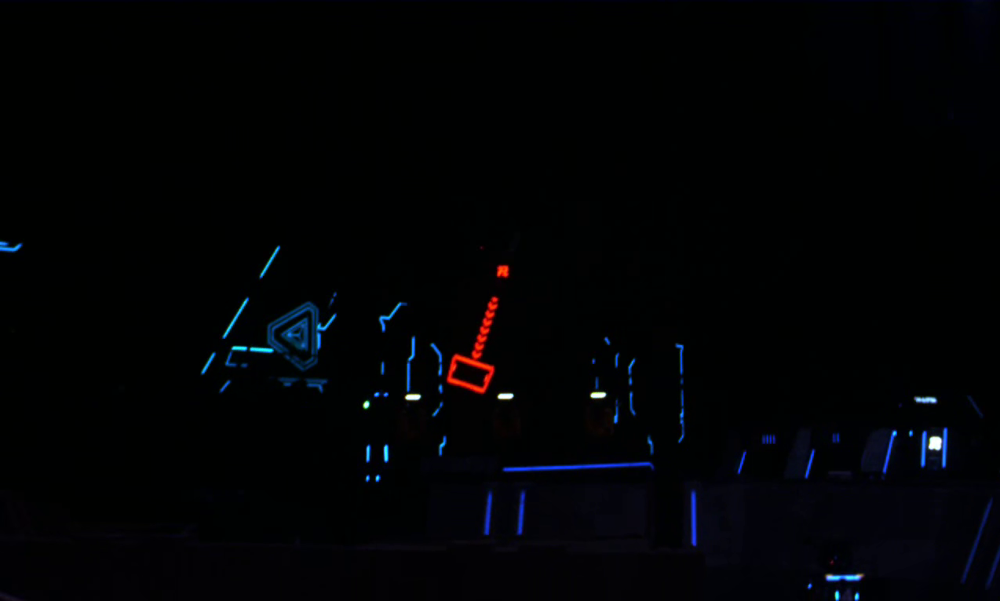
	下面是对于这张图片，我们提取红色部分颜色进行二值化的结果。
	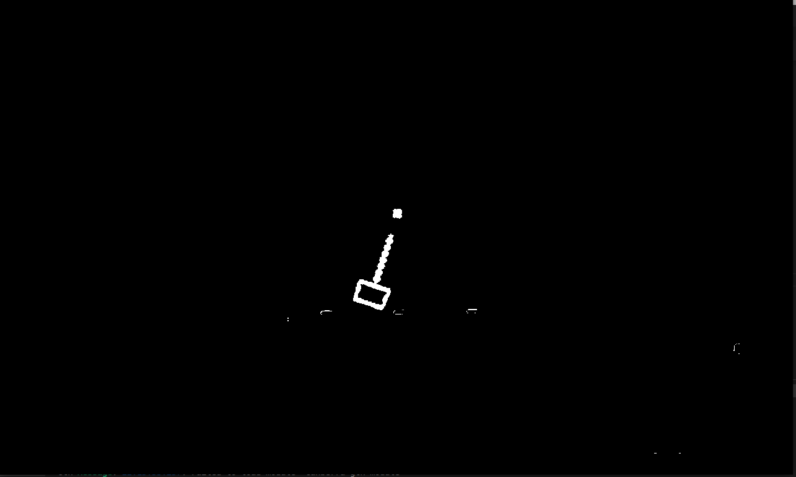
2. 滤波
	由于相机采样本身存在噪声，同时自然环境中也有各种光噪声干扰，因此我们常常对二值化图像进行滤波来减小噪声。
	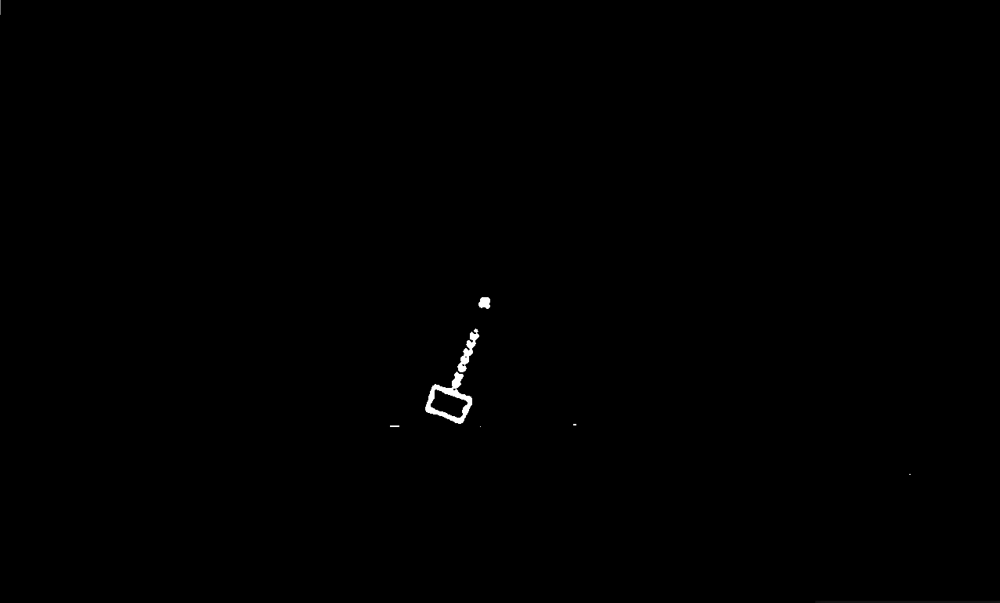
	这张图片是对原图进行中值滤波的结果，可以看到图像中的噪点变少，图像更加平滑。
3. 形态学运算
	如果我们仔细观察滤波后的图像，我们会发现图像中扇叶下端的流动条中间有缝隙。这种缝隙被称为``HSV空洞``，在现实场景中往往难以避免。但``HSV空洞``会导致图像轮廓断裂，给基于轮廓的传统视觉带来各种不同的困难。因此我们常常使用形态学运算消除这种缝隙。
	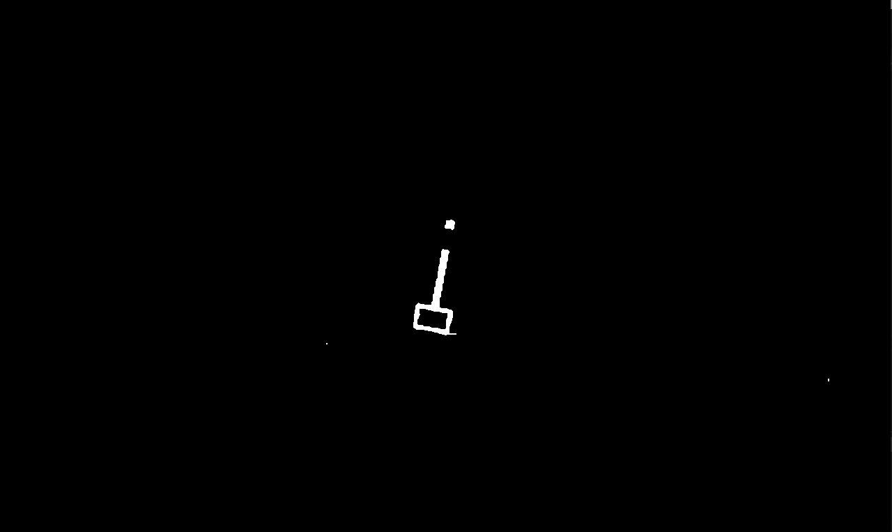
	上图是做了一遍形态学开运算后的结果，可以看到流动条处的``HSV空洞``已经基本消除。
4. 边缘检测&轮廓提取
	图像是一段连续的点阵，然而想让计算机理解这些点阵并不是一件容易的事，因此我们常常需要从图像中提取出轮廓来方便后续的操作。
	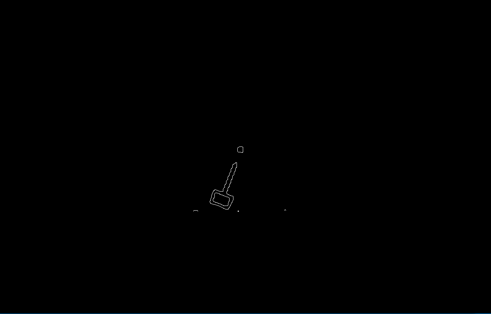
	上图是对二值化图像执行canny算法之后得到的边缘检测结果。
	但边缘检测的输出结果一般仍然是一张图片，为了方便研究轮廓的特征，我们所需要的是一个点序列构成的轮廓。
	由于轮廓提取的结果难以可视化，我们将在后面进行更详细的讲述。
5. 对轮廓进行几何约束并筛选目标轮廓
	往往一张图片在二值化后不只有一个轮廓，而轮廓提取本身会将所有的轮廓序列全部提取出来。对于这些轮廓，我们需要进行筛选来选出最终的目标轮廓。
	这种筛选一般基于轮廓的拓扑特征或者几何特征进行。将会在后文中进行更详细的讲述。

### 二值化及其方法

图像二值化的作用已经在上文中叙述，下面讲述二值化的具体方法。

**对于不同格式的图像，二值化的需求不同，实现的方法也不同。**
例如对于一张彩色图片，我们往往需要提取指定颜色来实现二值化；而对于一张灰度图片，我们往往需要提取出颜色较淡的区域或颜色较深的区域。

下面先介绍灰度图片的二值化方法
#### 灰度图片的二值化
##### 设定阈值法
通过设定一个阈值以实现二值化是最简单的二值化方法。
对于一张图片，他的每一个像素都处在区间$[0, 255]$之中。我们只需要设定一个中间值￥$threshold$，令
$$
result[i][j] = \begin{cases}
0 & image[i][j] \leq threshold \\
255 & image[i][j] > threshold 
\end{cases} 
$$
这样就可以将所有灰度大于$threshold$的像素点转换为白色，所有灰度小于$threshold$的像素点转换为黑色。这样一个最简单的二值化就完成了。

在``OpenCV``中提供了函数``double cv::threshold(InputArray src, OutputArray 	dst, double thresh, double 	maxval, int 	type)``实现图像的二值化。
下面讲解这个函数中的参数作用：
```
src:   输入
dst:   输出
thres: 设定的二值化阈值
maxval:使用 THRESH_BINARY 或 THRESH_BINARY_INV 进行二值化时使用的最大值
type:  二值化算法类型
```
其中二值化算法类型主要有一下几种：
```
THRESH_BINARY:		将小于 thres 的值变为 0 ，大于 thres 的值变为 255
THRESH_BINARY_INV:	将小于 thres 的值变为 255, 大于 thres 的值变为 0
THRESH_TRUNC:		将大于 thres 的值截取为 thres, 小于 thres 的值不变
THRESH_TOZERO:		将小于 thres 的值变为 0 , 大于 thres 的值不变
THRESH_TOZERO_INV:	将大于 thres 的值变为 0 , 小于 thres 的值不变
```
下面这张图片形象地讲述了``threshold``的几种方法的作用效果。
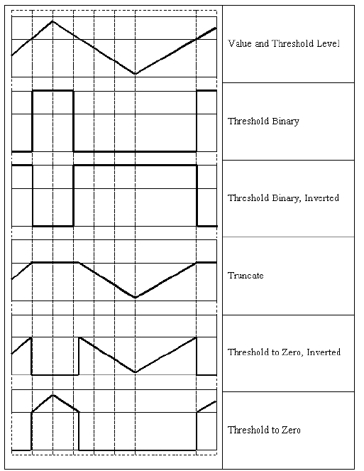

我们用下面一个例子熟悉一下设定``threshold``实现二值化的方法。

现在我们需要将这样一种图进行二值化，提取其中棋盘格黑色的区域：

我们用下面这段程序实现了这一功能：
```cpp
#include <opencv2/core/core.hpp>
#include <opencv2/highgui/highgui.hpp>
#include <opencv2/imgproc/imgproc.hpp>
#include <iostream>
#include <assert.h>

int main(int argc, char ** argv)
{
    cv::Mat src = cv::imread("/home/nvidia/Downloads/calibrate.jpg", cv::IMREAD_GRAYSCALE);     // 读入一张单通道图片
    assert(src.channels() == 1);    // 确保读入的图片为单通道图片
    cv::Mat binary_img;
    cv::threshold(src, binary_img, 100, 255, cv::THRESH_BINARY);
    cv::imshow("result", binary_img);
    cv::waitKey(0);
    return 0;
}
```
这是这段程序的运行结果：
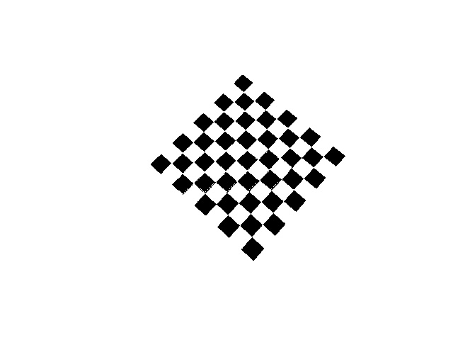
可以看到我们很好地提取出了黑色的部分。

##### 自适应二值化
在许多情况下，直接设定阈值的方法就可以得到比较好的效果，但在实际应用中，由于光环境的变化，一个固定的阈值往往难以满足变化的环境，这时候我们就需要一个算法自动求出一张图片中合适的阈值。

常用的方法有``大津二值化``方法，在``OpenCV``中也集成了这种方法。

前文已经介绍了``threshold``函数。事实上，他的传入参数``type``除了上文中介绍的几个参数外，还有一个方法类型叫``THRESH_OTSU``。
我们现在重新看这个函数的声明``double cv::threshold(InputArray src, OutputArray 	dst, double thresh, double 	maxval, int type)``。
当``type = cv::THRESH_OTSU``时，参数``thresh``无效，具体数值由``大津法``自行计算，并在函数的返回值中返回。

下面是一个使用``大津法``计算``thresh``的例子。
```cpp
#include <opencv2/core/core.hpp>
#include <opencv2/highgui/highgui.hpp>
#include <opencv2/imgproc/imgproc.hpp>
#include <iostream>
#include <assert.h>

int main(int argc, char ** argv)
{
    cv::Mat src = cv::imread("/home/nvidia/Downloads/calibrate.jpg", cv::IMREAD_GRAYSCALE);
    assert(src.channels() == 1);
    cv::Mat binary_img;
    double thres = cv::threshold(src, binary_img, 100, 255, cv::THRESH_OTSU);
    std::cout << thres << std::endl;
    cv::imshow("result", binary_img);
    cv::waitKey(0);
    return 0;
}
```
程序运行的结果与手动设定阈值的结果相似。

**但是设定单一阈值的方法仍然有明显的缺点，对于一张图中有明显的光线亮度渐变的图像，单一阈值往往难以起到好的效果**

例如这张图片，可以看到右下角亮度偏暗：


如果使用大津法自动求阈值并直接二值化，会得到类似下图的结果：


这样的结果并不是我们想要的。

为了解决这种问题，我们需要对每个区域局部适应区域内的灰度情况，对每个区域使用不同的阈值分别二值化。``OpenCV``中提供了``adaptiveThreshold``方法实现这一功能。
函数的声明如下：``void cv::adaptiveThreshold(InputArray src, OutputArray dst, double 	maxValue, int 	adaptiveMethod, int thresholdType, int blockSize, double C)	``
其中``adaptiveMethod``为自适应二值化算法使用的方法。``blockSize``为自适应二值化的算子大小，**注意必须为奇数**。``C``为用来手动调整阈值的偏置量大小。

这一方法的原理和其他具体信息不在这里赘述，感兴趣者请在OpenCV的API中自行搜索。

下面给出使用自适应二值化方法解决本例子的代码：
```cpp
#include <opencv2/core/core.hpp>
#include <opencv2/highgui/highgui.hpp>
#include <opencv2/imgproc/imgproc.hpp>
#include <iostream>
#include <assert.h>

int main(int argc, char ** argv)
{
    cv::Mat src = cv::imread("/home/nvidia/Downloads/newspaper.jpg", cv::IMREAD_GRAYSCALE);
    assert(src.channels() == 1);
    cv::Mat result;
    cv::adaptiveThreshold(src, result, 255, cv::ADAPTIVE_THRESH_GAUSSIAN_C, cv::THRESH_BINARY, 51, 0);
    cv::imshow("result", result);
    cv::waitKey(0);
    return 0;
}
```
这是自适应二值化算法的运行结果：


**对于灰度图的二值化算法就介绍到这里，下面介绍对于彩色图片的二值化方法**

#### 【前置知识】颜色空间
颜色空间是说明颜色的一种工具。就像坐标空间通过$x,y,z$三个坐标描述了三维空间中的每一个点，颜色空间也通过他自己的坐标轴描述了每一个颜色。

常见的颜色空间有``RGB``空间，``HSV``空间，``HSI``空间等。

对于没有接触过计算机视觉的同学，你可能更熟悉``RGB``空间。他通过红色，蓝色，绿色三个颜色通道描述了空间内的每一个颜色，例如红色在``RGB``空间中对应的坐标就是$(255, 0, 0)$。

然而，在计算机视觉中，``HSV``空间和``HSI``空间更常用。

下面主要介绍``HSV``空间。``HSV``空间通过色相(H)，饱和度(S)，和亮度(V)表示空间内的每一个颜色。下图为``HSV``空间的示意图：
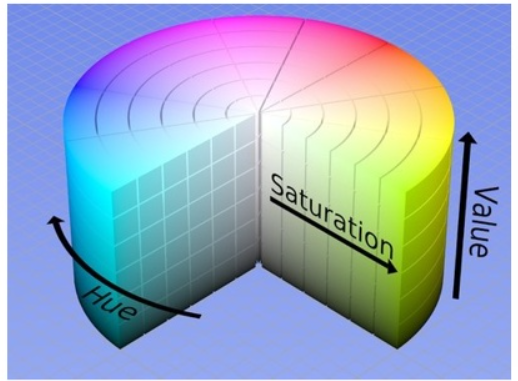
从上图中可以看出，``HSV``空间相对于``RGB``空间的一大优势，即``HSV``空间中每一种颜色所在的区域是连续的。
``HSV``空间的三个坐标都各有其范围：$H$坐标的范围为$[0,180]$，$S$和$V$得范围都为$[0, 255]$。

在OpenCV中，提供了几种颜色空间转换的函数``cvtColor``。
其声明为：``void cv::cvtColor(InputArray src, OutputArray dst, int code, int 	dstCn = 0)``
其中``code``为具体的颜色空间转换指令，常用的指令有：
```
COLOR_BGR2HSV:	从BGR转为HSV
COLOR_BGR2GRAY:	从BGR转为灰度图
COLOR_BGR2RGB:	从BGR转为RGB
```
**这里需要注意的是，在OpenCV中，图片读入后的默认颜色空间为BGR空间，而不是RGB空间**

下面是一个使用``cvtColor``函数的例子：
```cpp
#include <opencv2/core/core.hpp>
#include <opencv2/highgui/highgui.hpp>
#include <opencv2/imgproc/imgproc.hpp>
#include <iostream>
#include <assert.h>

int main(int argc, char ** argv)
{
    cv::Mat src = cv::imread("/home/nvidia/Downloads/energy.jpg");
    assert(src.channels() == 3);
    cv::imshow("src", src);
    cv::Mat hsv_img;
    cv::cvtColor(src, hsv_img, cv::COLOR_BGR2HSV);
    cv::imshow("hsv", hsv_img);
    cv::Mat gray_img;
    cv::cvtColor(src, gray_img, cv::COLOR_BGR2GRAY);
    cv::imshow("gray", gray_img);
    cv::waitKey(0);
    return 0;
}
```

##### 多通道相减
对于，彩色图片的二值化，最容易想到的方法是颜色通道相减并二值化的方法。
例如下图中，如果想要分离红色。那么通过红色通道与蓝色通道相减就可以取得极佳的效果：

下面这段代码实现了通过多通道相减的方法对此图进行二值化。
```cpp
#include <opencv2/core/core.hpp>
#include <opencv2/highgui/highgui.hpp>
#include <opencv2/imgproc/imgproc.hpp>
#include <iostream>
#include <assert.h>

int main(int argc, char ** argv)
{
    cv::Mat src = cv::imread("/home/nvidia/Downloads/energy.jpg");
    assert(src.channels() == 3);      // 检测是否为三通道彩色图片
    
    cv::Mat channels[3];
    cv::split(src, channels);         // 三通道分离

    cv::Mat red_sub_blue = channels[2] - channels[0];    // 红蓝通道相减
    cv::Mat normal_mat;
    cv::normalize(red_sub_blue, normal_mat, 0., 255., cv::NORM_MINMAX);   // 归一化到[0, 255]

    cv::Mat result;
    cv::threshold(normal_mat, result, 100, 255, cv::THRESH_OTSU);     // OTSU自适应阈值

    cv::imshow("src", src);
    cv::imshow("norm", normal_mat);
    cv::imshow("result", result);
    cv::waitKey(0);
    return 0;
}
```
他得到的结果如图：
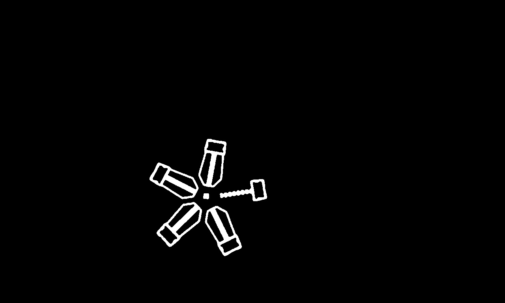

多通道相减的方法很方便，但也有许多局限性，例如，如果使用多通道相减的方法，就很难区分红色和橙色。尤其是在背景中出现白光干扰时，多通道相减将难以下手。因此只有在处理少数图像中色相相差较大的情况比较合适。

##### HSV颜色提取
``HSV颜色提取``是传统视觉中最常用，也是适用性最广的二值化方法。

前文中已经介绍了``HSV颜色空间``的概念，他有一个重要的性质，即同一种颜色在``HSV颜色空间``是连续的。因此，如果我们想要提取图像中的某一种颜色，那么只需要找到所求颜色在``HSV空间``中出现的坐标范围，并把图像中处在这个区间内的像素点的值全部置为$255$，其余值置为$0$即可完成二值化。

我们下面仍然以这张图为例：


我们想要提取的颜色为红色和橙色的区域，通过百度搜索，我们了解到红色和橙色的颜色在``HSV空间``中处于区间$ [(0, 43, 46), (25, 255, 255)] \bigcup [(156, 43, 46), (180, 255, 255)] $中。


而OpenCV又提供了可以实现颜色提取的函数``inRange()``。
下面为``inRange``函数的具体声明：``void cv::inRange(InputArray src, InputArray lowerb, InputArray upperb, OutputArray dst )``

其中``lowerb``和``upperb``分别对应``HSV``空间中坐标范围的下界和上界。如果需要提取多个``HSV空间``范围中的颜色，那么需要执行多次``inRange``并将得到的颜色取并集。

下面这段程序将使用``HSV颜色提取``完成本图片的二值化。
```cpp
#include <opencv2/core/core.hpp>
#include <opencv2/highgui/highgui.hpp>
#include <opencv2/imgproc/imgproc.hpp>
#include <iostream>
#include <assert.h>

int main(int argc, char ** argv)
{
    cv::Mat src = cv::imread("/home/nvidia/Downloads/energy.jpg");
    assert(src.channels() == 3);      // 检测是否为三通道彩色图片

    cv::Mat hsv;
    cv::cvtColor(src, hsv, cv::COLOR_BGR2HSV);   // 将颜色空间从BGR转为HSV
    
    cv::Mat hsv_part1, hsv_part2;
    cv::inRange(hsv, cv::Scalar(0, 43, 46), cv::Scalar(25, 255, 255), hsv_part1);
    cv::inRange(hsv, cv::Scalar(156, 43, 46), cv::Scalar(180, 255, 255), hsv_part2);   // 提取红色和橙色

    cv::Mat ones_mat = cv::Mat::ones(cv::Size(src.cols, src.rows), CV_8UC1);
    cv::Mat hsv_result = 255 * (ones_mat - (ones_mat - hsv_part1 / 255).mul(ones_mat - hsv_part2 / 255));
    // 对hsv_part1的结果和hsv_part2的结果取并集

    cv::imshow("hsv", hsv_result);
    cv::waitKey(0);
    return 0;
}
```
他得到的结果如图：


当然，``HSV颜色提取``虽然是一种非常优秀的二值化方法，但他也存在自己的局限性。例如亮度的变化会对``HSV``数值造成干扰。同时，在实际使用过程中，如果相机的感光元件敏感度较高，也会造成图像中出现噪点，形成椒盐噪声。此外，在感光角度不同时，相机获取到的颜色饱和度和色相也会发生一定程度的变化，造成``HSV空洞``。

### 图像滤波与形态学运算
在对现实中的图像进行二值化时，二值化的结果往往难以达到最佳状态。许多情况下，二值化会产生空洞或形成噪点。在这种情况下就需要``滤波``和``形态学运算``这两大工具来提升二值化结果的质量。

我们首先介绍几个比较常用的滤波算法。
##### 均值滤波
``均值滤波``是最简单的滤波，也被成为``线性平滑滤波``。
他通过和图像卷积均值滤波算子进行滤波。
$$ K = \frac{1}{ksize.width \times ksize.height} \times \left[\begin{matrix} 1 & 1 & ... & 1 \\
1 & 1 & ... & 1\\
... & ... & ... & ... \\
1 & 1 & ... & 1 \\
 \end{matrix} \right] \\
 $$
 即对大小为$ksize$的矩形框内的像素取平均值。

在OpenCV中给出了对``均值滤波``的实现，即函数``blur()``。
他的具体声明如下：``void cv::blur(InputArray src, OutputArray dst, Size ksize, Point 	anchor = Point(-1,-1), int borderType = BORDER_DEFAULT)``。
其中``ksize``即为卷积的矩阵的大小。

例如下图中，我们有一张看起来点很多的图：


以下的代码使用均值滤波试图对其进行滤波：
```cpp
#include <opencv2/core/core.hpp>
#include <opencv2/highgui/highgui.hpp>
#include <opencv2/imgproc/imgproc.hpp>
#include <iostream>
#include <assert.h>

int main(int argc, char ** argv)
{
    cv::Mat src = cv::imread("/home/nvidia/Downloads/noise.jpg");

    cv::Mat blured_img;
    cv::blur(src, blured_img, cv::Size(7, 7));

    cv::imshow("src", src);
    cv::imshow("blured", blured_img);
    cv::waitKey(0);
    return 0;
}
```
滤波的结果如图：
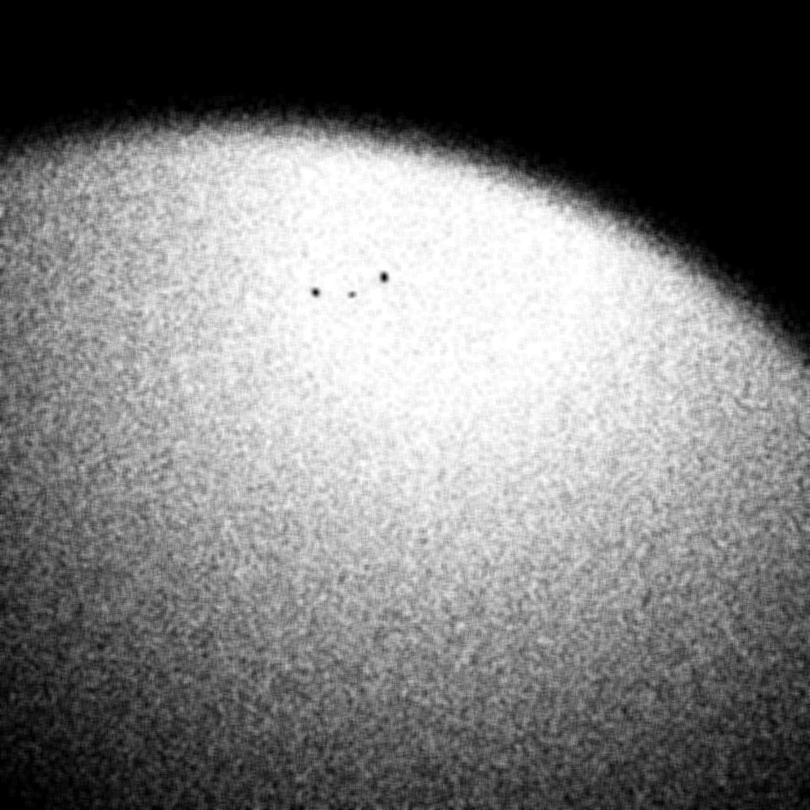

可以看到均值滤波的结果只是使得图片更加模糊，噪声并没有得到很好的消除。
均值滤波是最快速的滤波算法之一，但同时它的效果却也不够理想，一般无法有效地去除椒盐噪声，

##### 高斯滤波
高斯滤波通过对图像卷积高斯滤波算子实现滤波的效果。
高斯滤波算子由高斯函数计算得到：
$$G(x, y) = {\frac{1}{2\pi \rho^2}}e^{-\frac{x^2 + y^2}{2 \rho^2}}$$
例如这就是一个高斯算子：
$$\frac{1}{16} \times \left[\begin{matrix} 1 & 2 & 1 \\
2 & 4 & 2\\
1 & 2 &1 \\
\end{matrix}\right]
$$

OpenCV中给出了``高斯滤波``的实现：``GaussianBlur()``
他的具体声明如下：``void cv::GaussianBlur(InputArray src, OutputArray 	dst, Size ksize, double sigmaX, double sigmaY = 0, int borderType = BORDER_DEFAULT)``
其中``ksize``为高斯算子的大小，``sigmaX``和``sigmaY``为高斯函数在$x,y$方向上的偏置。

一下代码实现了对上图的高斯滤波：
```cpp
#include <opencv2/core/core.hpp>
#include <opencv2/highgui/highgui.hpp>
#include <opencv2/imgproc/imgproc.hpp>
#include <iostream>
#include <assert.h>

int main(int argc, char ** argv)
{
    cv::Mat src = cv::imread("/home/nvidia/Downloads/noise.jpg");

    cv::Mat blured_img;
    cv::GaussianBlur(src, blured_img, cv::Size(7, 7), 0, 0);

    cv::imshow("src", src);
    cv::imshow("blured", blured_img);
    cv::waitKey(0);
    return 0;
}
```

滤波效果如图：

可以看到图中的噪声仍然很大，但图像在平滑效果和特征保留上相对均值滤波都有一定的提升。

##### 中值滤波

中值滤波与前两者最大的不同在于，均值滤波和高斯滤波均为线性滤波，而中值滤波为非线性滤波。
非线性滤波相对于线型滤波，往往都有更好的滤波效果，但代价是会有远高于线型滤波的时间开销。

他通过对方阵内的数进行排序并取中值来进行滤波，往往在去除椒盐噪声时有良好的效果。

下面的代码为使用中值滤波实现的对上图的滤波：
```cpp
#include <opencv2/core/core.hpp>
#include <opencv2/highgui/highgui.hpp>
#include <opencv2/imgproc/imgproc.hpp>
#include <iostream>
#include <assert.h>

int main(int argc, char ** argv)
{
    cv::Mat src = cv::imread("/home/nvidia/Downloads/noise.jpg");

    cv::Mat blured_img;
    cv::medianBlur(src, blured_img, 7);


    cv::imshow("src", src);
    cv::imshow("blured", blured_img);
    cv::waitKey(0);
    return 0;
}
```
下图为中值滤波的效果：
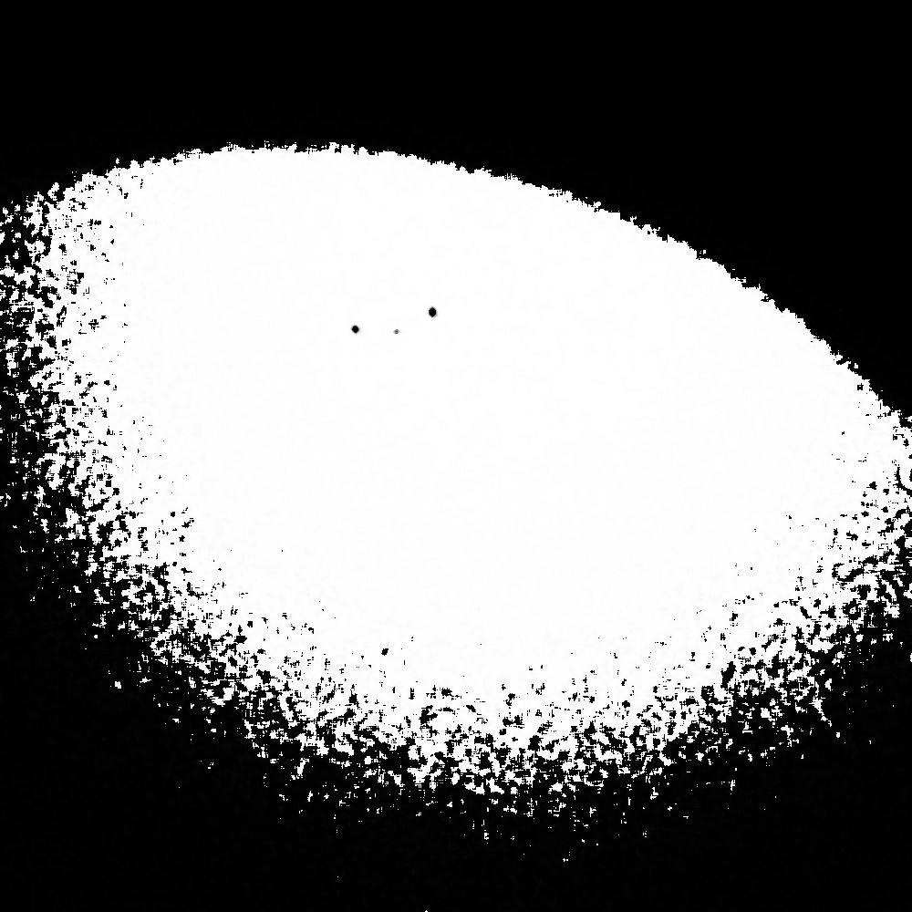
可以看到中值滤波在去除椒盐噪声上有着良好的表现，但在信息的保存上劣于高斯滤波。

##### 形态学运算

[这部分教程尚未完成，可以先自学网上的博客](https://blog.csdn.net/fb_941219/article/details/83448785)

### 边缘检测与轮廓提取

在完成图像的二值化后，我们可以开始处理我们真正感兴趣的东西——轮廓。
边缘检测算法是常用于画出图像中轮廓的方法，他们的基本原理大体上都是感知图像中像素层面上的梯度。
``Canny``算法是比较常用的边缘检测算法，OpenCV中同样给出了他的实现``Canny()``。
他的具体声明如下：``void cv::Canny(InputArray image, OutputArray edges, double threshold1, double threshold2, int apertureSize = 3, bool L2gradient = false)``

下面是一个使用``Canny``的例子，使用``Canny``算法检测我们在二值化部分输出结果中的边缘部分。
```cpp
#include <opencv2/core/core.hpp>
#include <opencv2/highgui/highgui.hpp>
#include <opencv2/imgproc/imgproc.hpp>
#include <iostream>
#include <assert.h>

int main(int argc, char ** argv)
{
    cv::Mat src = cv::imread("/home/nvidia/Downloads/energy-hsv.jpg", cv::IMREAD_GRAYSCALE);
    assert(src.channels() == 1);

    cv::Mat canny_result;
    cv::Canny(src, canny_result, 50, 100, 3);

    cv::imshow("src", src);
    cv::imshow("canny", canny_result);
    cv::waitKey(0);
    return 0;
}
```

边缘检测的效果如图：


**但是Canny只能在图像中画出检测出的边缘，而我们真正感兴趣的是有点序列构成的边缘，因为对这种边缘信息我们才能分析它的几何和拓扑特征**

对此，OpenCV不会让我们失望，他同样提供了函数``findContours()``来完成轮廓提取操作。
下面给出它的具体声明：``void cv::findContours(InputArray 	image, OutputArrayOfArrays contours, OutputArray hierarchy, int mode, int method, Point offset = Point() )``

其中``image``为需要进行轮廓提取的图像，``contours``为提取到的轮廓序列，``hierarchy``中记录了轮廓间的拓扑结构，``mode``指示提取出的轮廓的储存方法，``method``指示使用的轮廓提取方法。

其中``mode``常用的有一下几种：
```
RETR_EXTERNAL:		只列举外轮廓
RETR_LIST:			用列表的方式列举所有轮廓
RETR_TREE:			用树状的结构表示所有的轮廓，在这种模式下会在hierachy中记录轮廓的父子关系
```
需要注意的是，``hierachy``的记录格式如下：
**对于每一个轮廓，hierarchy都包含4个整型数据，分别表示：后一个轮廓的序号、前一个轮廓的序号、子轮廓的序号、父轮廓的序号。**

其中``method``常用的有一下几种：
```
CHAIN_APPROX_NONE:		绝对的记录轮廓上的所有点
CHAIN_APPROX_SIMPLE:	记录轮廓在上下左右四个方向上的末端点（轮廓中的关键节点）
```

下面演示如何使用``RETR_TREE``模式按照拓扑关系画出所有轮廓：
```cpp
#include <opencv2/core/core.hpp>
#include <opencv2/highgui/highgui.hpp>
#include <opencv2/imgproc/imgproc.hpp>
#include <iostream>
#include <vector>
#include <assert.h>

void dfs(cv::Mat &drawer, 
        const std::vector< std::vector<cv::Point> > &contours,
        const std::vector< cv::Vec4i > &hierachy,
        const int &id, 
        const int &depth)
{
    if (id == -1)
        return;
    static cv::Scalar COLOR_LIST[3] = { {220, 20, 20}, {20, 220, 20}, {20, 20, 220} };
    cv::drawContours(drawer, contours, id, COLOR_LIST[depth % 3], 1);
    for (int i = hierachy[id][2]; i + 1; i = hierachy[i][0])
    {
        dfs(drawer, contours, hierachy, i, depth + 1);     // 向内部的子轮廓递归
    }
}

int main(int argc, char ** argv)
{
    cv::Mat src = cv::imread("/home/nvidia/Downloads/energy.jpg");
    assert(src.channels() == 3);      // 检测是否为三通道彩色图片

    cv::Mat hsv;
    cv::cvtColor(src, hsv, cv::COLOR_BGR2HSV);   // 将颜色空间从BGR转为HSV
    
    cv::Mat hsv_part1, hsv_part2;
    cv::inRange(hsv, cv::Scalar(0, 43, 46), cv::Scalar(25, 255, 255), hsv_part1);
    cv::inRange(hsv, cv::Scalar(156, 43, 46), cv::Scalar(180, 255, 255), hsv_part2);   // 提取红色和橙色

    cv::Mat ones_mat = cv::Mat::ones(cv::Size(src.cols, src.rows), CV_8UC1);
    cv::Mat hsv_result = 255 * (ones_mat - (ones_mat - hsv_part1 / 255).mul(ones_mat - hsv_part2 / 255));
    // 对hsv_part1的结果和hsv_part2的结果取并集

    std::vector< std::vector<cv::Point> > contour;
    std::vector< cv::Vec4i > hierachy;

    cv::findContours( hsv_result, contour, hierachy, cv::RETR_TREE, cv::CHAIN_APPROX_NONE);
    
    cv::Mat drawer = cv::Mat::zeros(cv::Size(src.cols, src.rows), CV_8UC3);
    for (int i = 0; i + 1; i = hierachy[i][0])
        dfs(drawer, contour, hierachy, i, 0);     // 遍历所有轮廓
    
    cv::imshow("src", src);
    cv::imshow("contours", drawer);
    cv::waitKey(0);
    return 0;
}
```

实现效果如图：
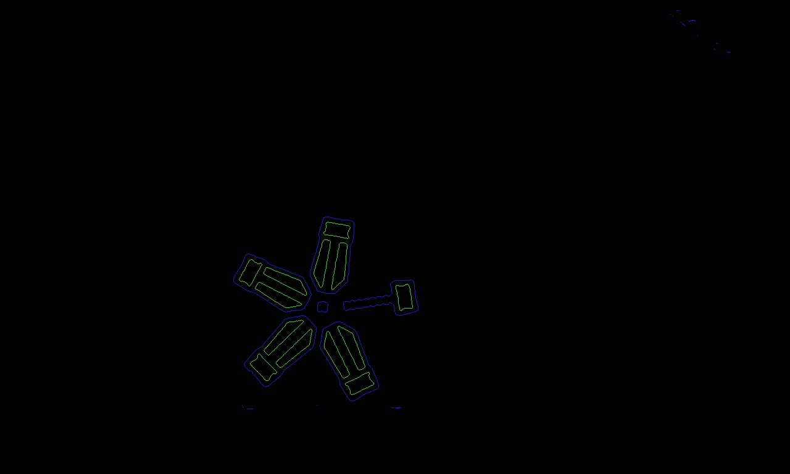

#### 轮廓筛选
通过``findContours``完成轮廓提取后，我们面对的问题便是如何对提取出的轮廓进行筛选，在大量的轮廓中找出我们感兴趣的轮廓。

**轮廓筛选最基本的思想就是用轮廓自身的几何性质以及轮廓间的几何关系，实现对目标轮廓的约束，排除不感兴趣的轮廓。**

**在这一步骤中，我们有几个常用的函数：**
* double cv::contourArea(InputArray 	contour, bool oriented = false)	
	* 这个函数可以用来求出一个轮廓的大小
	* 第一个参数为输入的轮廓
	* 另外，若第二个参数为``true``，则函数会返回一个带有符号的浮点数，符号基于轮廓的方向
	* 如果第二个参数为``false``，则函数会返回轮廓面积的绝对值。
* double cv::arcLength(InputArray curve, bool closed)	
	* 这个函数可以用来求出一个轮廓的周长
	* 第一个参数为输入的轮廓
	* 第二个参数为轮廓是否是封闭的
	* 返回轮廓的周长
* Rect cv::boundingRect(InputArray array)
	* 这个函数输入一个轮廓，返回最小的包含轮廓的正向外接矩形（不带有旋转）
* RotatedRect cv::minAreaRect(InputArray points)
	* 这个函数输入一个轮廓，返回轮廓的最小外接矩形（带有旋转）
* void cv::convexHull(InputArray points, OutputArray hull, bool clockwise=false, bool returnPoints=true)	
	* 此函数被用来求解轮廓的凸包
	* 第一个参数为输入的轮廓，第二个参数为输出的凸包
	* 第三个参数如果为``true``，则返回顺时针的轮廓，如果为``false``，则返回逆时针。
	* 第四个参数如果为``true``，则用点表示凸包，如果为``false``，则用点的索引表示凸包，在``hull``的类型为``vector``的情况下，第四个参数失效，依靠``vector``的类型决定。


**下面列举几个常用轮廓筛选的手段：**
#### 面积/周长大小约束
面积/周长大小约束是最简单的约束之一，即通过轮廓所包含区域的大小或是轮廓的周长大小筛选指定的轮廓。
这种方法虽然简单粗暴，但对于一些环境干扰小的简单环境往往能够取得相当不错的效果。
下面是一个简单的例子：
```cpp
bool judgeContourByArea(const std::vector<cv::Point> &contour)
{
    
    if (cv::contourArea(contour) > 2000) // 舍弃小轮廓
        return true;
    return false;
}
```
他对能量机关的轮廓提取如图：
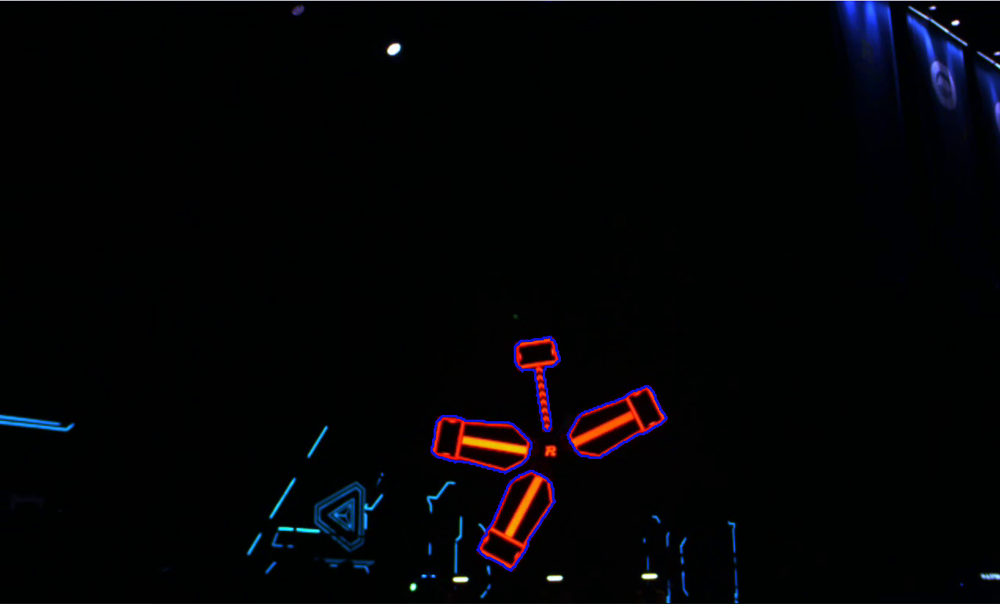

这种方法简单高效，但也尤其缺点，确定是**鲁棒性低，容易受干扰**，对于每一个场景往往**需要针对输入调参**后才能使用。

#### 轮廓凹凸性约束
这种方法能通过轮廓的凹凸性对凹轮廓或凸轮廓进行有针对性的筛选。
一般来说可以通过将``轮廓的凸包``与``轮廓本身``进行比较来实现。

常用的比较方法有：
* 面积比例比较
	* 对于凸轮廓，轮廓的凸包面积与轮廓本身的面积比应该接近$1:1$，而一般的凹轮廓的比值应该明显大于$1$。
* 周长比值比较
	* 一般来说，对于凸轮廓，轮廓的凸包周长和轮廓本身的周长相近，而凹轮廓的轮廓本身周长应当明显大于凸包周长

下面是一个简单的例子，筛选轮廓中的凹轮廓：
```cpp
bool judgeContourByConvexity(const std::vector<cv::Point> &contour)
{
    if (contourArea(contour) < 500) // 去除过小轮廓的干扰
        return false;
    double hull_area, contour_area;

    std::vector<cv::Point> hull;
    cv::convexHull(contour, hull);

    hull_area = cv::contourArea(hull);
    contour_area = cv::contourArea(contour);
    if (hull_area > 1.5 * contour_area)    // 判断凹凸性
        return true;
    return false;
}
```
他对能量机关的提取如图：
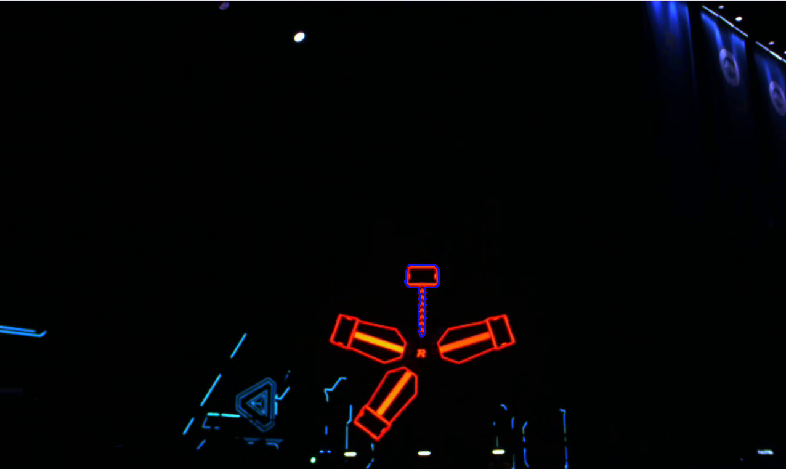

#### 与矩形相似性约束
在轮廓筛选时常常会需要筛选一些较规则的形状，如矩形轮廓等。
在这种情况下，一般来说我们可以通过将``轮廓的最小外接矩形``与``轮廓本身``进行比较来实现筛选。

常见的筛选方法与凹凸性约束相似，**也是通过面积和周长比较来实现**。
此外，由于矩形的特殊性，也可以通过**矩形的长宽比**进行筛选。

下面是一个简单的例子，筛选能量机关的装甲板轮廓：
```cpp
bool judgeContourByRect(const std::vector<cv::Point> &contour)
{
    if (cv::contourArea(contour) < 500)     // 排除小轮廓的干扰
        return false;
    double rect_area, contour_area, rect_length, contour_length;

    cv::RotatedRect rect = cv::minAreaRect(contour);
    rect_area = rect.size.area();
    contour_area = cv::contourArea(contour);

    if (rect_area > 1.3 * contour_area)    // 轮廓面积约束
        return false;
    rect_length = (rect.size.height + rect.size.width) * 2;
    contour_length = cv::arcLength(contour, true);
    if (std::fabs(rect_length - contour_length) / std::min(rect_length, contour_length) > 0.1)         // 轮廓周长约束
        return false;
    if (std::max(rect.size.width, rect.size.height) / std::min(rect.size.width, rect.size.height) > 1.9)       // 长宽比约束
        return false;
    
    return true;
}
```
运行结果如图：
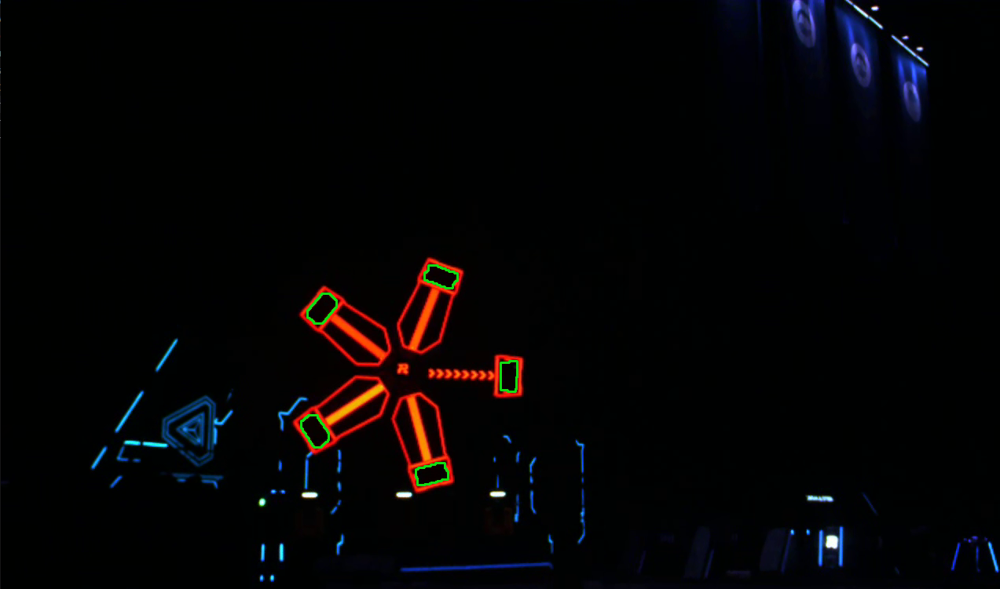

以上几种方法是主要的几种基于``单个轮廓本身几何性质``的筛选方法，下面介绍几种轮廓间几何关系的约束。

#### 拓扑关系约束

在一张复杂的图片中，轮廓中往往有各种复杂的拓扑关系。
例如一个轮廓，他的拓扑关系可能有以下几种主要性质：
* 是否是最外层轮廓
* 是否是最内层轮廓
* 是否有子轮廓
	* 子轮廓的个数是多少
* 他是谁的子轮廓
* ……

例如当我们想筛选未被激活的装甲板，我们会发现他有两个拓扑关系：
1. 他是最外层轮廓
2. 他有一个子轮廓

再或者我们想筛选已经被激活的装甲板，我们会发现他也有连个拓扑关系：
1. 他是最外层子轮廓
2. 他有三个子轮廓

下面是一个简单的例子，筛选已经被激活的装甲板：
```cpp
bool judgeContourByTuopu(const std::vector<cv::Vec4i> &hierachy, const int &id, const int &dep)
{
    if (dep != 0)       // 判断是否是最外层轮廓
        return false;
    
    int cnt = 0;
    for (int i = hierachy[id][2]; i+1; i = hierachy[i][0])   // 子轮廓计数
        cnt++;
    if (cnt != 3)     // 判断子轮廓个数是否为3
        return false;

    return true;
}
```

运行结果如图：


#### 通过与其他轮廓的几何关系判断

这种方法整体上灵活多变，要根据具体情况选择具体方法，整体的思想是通过与另一个已知轮廓（也可能未知）的几何关系进行筛选。

这里以筛选已激活装甲板中的空白区域为例：
观察发现，已激活装甲板中的空白区域为一个接近矩形的四边形，其中的长边与扇叶的最小外接矩形的长边有着**接近垂直**的几何关系。
而在上一问中，我们已经筛选出了已激活装甲板，因此这里我们可以利用这一性质完成空白区域的筛选。


下面是一个简单的例子：
```cpp
bool judgeContourByRelation(const std::vector<std::vector<cv::Point>> &contours, const std::vector<cv::Vec4i> &hierachy, const int &id, const int &dep)
{
    if (!(hierachy[id][3] + 1))     // 去除最外层轮廓
        return false;
    if (dep != 1)                   // 判断是否是第二层轮廓
        return false;
    if (!judgeContourByTuopu(hierachy, hierachy[id][3], dep - 1))   // 判断外轮廓是否为已激活扇叶
        return false;
    cv::RotatedRect rect_father = cv::minAreaRect(contours[hierachy[id][3]]);
    cv::RotatedRect rect_this = cv::minAreaRect(contours[id]);
    cv::Point2f direction_father;
    cv::Point2f direction_this;

// 寻找父轮廓最小外接矩形的短边
    cv::Point2f pts[4];
    rect_father.points(pts);
    double length1 = std::sqrt((pts[0].x - pts[1].x) * (pts[0].x - pts[1].x) + (pts[0].y - pts[1].y) * (pts[0].y - pts[1].y));
    double length2 = std::sqrt((pts[2].x - pts[1].x) * (pts[2].x - pts[1].x) + (pts[2].y - pts[1].y) * (pts[2].y - pts[1].y));
    if (length1 < length2)
        direction_father = {pts[1].x - pts[0].x, pts[1].y - pts[0].y};
    else
        direction_father = {pts[2].x - pts[1].x, pts[2].y - pts[1].y};
   
// 寻找当前轮廓最小外接矩形的长边 
    rect_this.points(pts);
    length1 = std::sqrt((pts[0].x - pts[1].x) * (pts[0].x - pts[1].x) + (pts[0].y - pts[1].y) * (pts[0].y - pts[1].y));
    length2 = std::sqrt((pts[2].x - pts[1].x) * (pts[2].x - pts[1].x) + (pts[2].y - pts[1].y) * (pts[2].y - pts[1].y));
    if (length1 > length2)
        direction_this = {pts[1].x - pts[0].x, pts[1].y - pts[0].y};
    else
        direction_this = {pts[2].x - pts[1].x, pts[2].y - pts[1].y};

// 计算[父轮廓最小外接矩形的短边]与[当前轮廓最小外接矩形的长边]夹角的余弦值
    double cosa = (direction_this.x * direction_father.x + direction_this.y * direction_father.y) / 
                std::sqrt(direction_this.x * direction_this.x + direction_this.y * direction_this.y) /
                std::sqrt(direction_father.x * direction_father.x + direction_father.y * direction_father.y);
    std::cout << cosa << std::endl;
    if (std::fabs(cosa) > 0.1)    // 筛选不符合条件的轮廓
        return false;
    return true;
}
```

运行结果如图：


#### 对于轮廓筛选的部分就介绍到这里，传统视觉的奥妙远不止于此。以上内容有一部分是笔者的个人总结，并不一定是主流方法。读者可以在实践中慢慢探索，寻找自己的传统视觉的思路。


----

作者：冯临溪，github主页：[传送门](https://github.com/E-T-E-R-N-A-L-B-L-U-E)。
